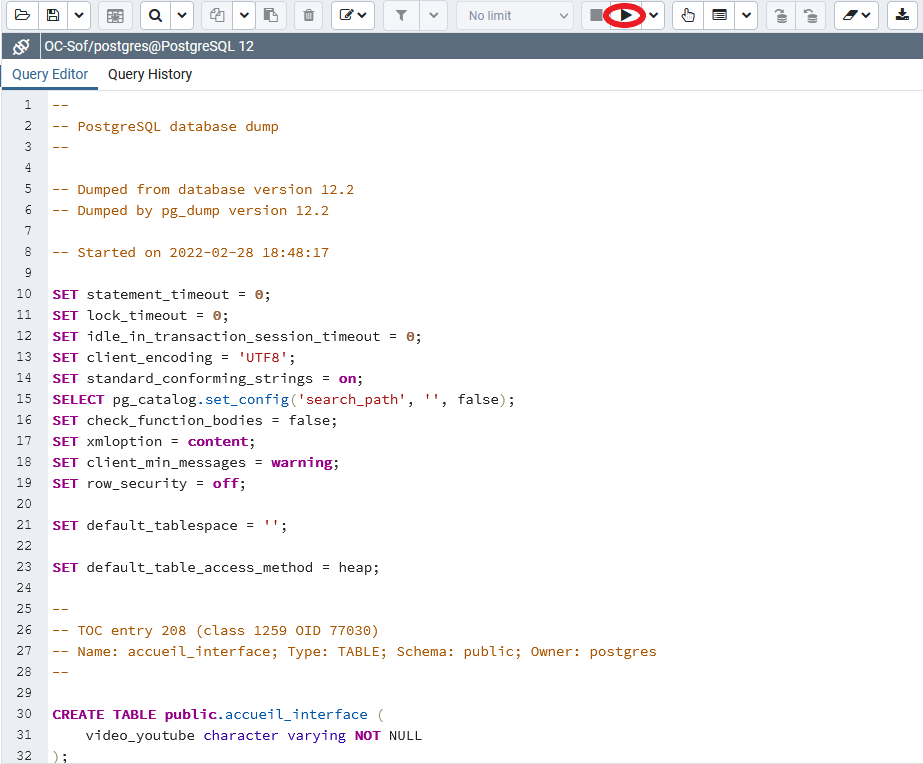

# Projet12_Sof
Développement d'un site pour "Sof", compositrice interprète, qui a créé l'association "Couleur Dièse"

---

---

## I - Installation complete du projet

---  

### 1 - Récupération et installation du projet

---  

- Tout d'abord, récupérez le repo dans cette page en copiant l'url comme indiqué en-dessous :

- Ensuite, vous aurez besoin du logiciel GitBash que vous pouvez télécharger [ici](https://gitforwindows.org/), pour télécharger le clone du projet.

- Installez le logiciel et Faite un clic droit à l'endroit ou vous souhaitez mettre votre projet, puis sélectionner Git Bash Here :

- Le logiciel Git Bash s'ouvre automatiquement, et se place directement dans l'emplacement, où vous vous trouvez.
  Il ne vous reste plus qu'a saisir la ligne de commande suivante pour récupérer le projet dans votre système :  
  git clone https://github.com/aquel69/Projet12_SiteSof_v1.git

Vous devriez avoir maintenant tous les fichiers du projets dans votre dossier :

### 2 - Ouverture du projet avec IntelliJ IDEA

---  

- Maintenant que notre projet se trouve dans notre dossier, nous allons pouvoir le lancer dans un IDE comme Intellij IDEA,
  disponible à cette [adresse](https://www.jetbrains.com/fr-fr/idea/).

- Une fois l'installation d'Intellij effectué, cliquez sur 'Open', sélectionnez le dossier du projet et cliquez sur 'ok'.

- Vous devez vous retrouvez avec une arborescence du projet comme celle-ci :

### 3 - Configuration du projet avec IntelliJ IDEA

---  

- Il faut maintenant configurer le projet, pour ceci allez dans File -> Project Structure et dans le premier onglet 'Project'  
  modifier le SDK comme indiquer sur le screen, avec la version 11 disponible [ici](https://www.oracle.com/fr/java/technologies/javase/jdk11-archive-downloads.html),
  si vous ne l'avez par encore installé :

### 3 - Installation de PgAdmin 4 et création de la base de données

---  

- Tout d'abord, installons l'interface pgAdmin 4 que vous pouvez télécharger [ici](https://www.pgadmin.org/download/).
- L'interface va nous permettre d'effectuer des requêtes postgresql, afin d'effectuer l'installation de notre base de données.
- Rdv dans l'interface de pgAdmin et ajoutez une base de données :  
  clic droit sur PostgreSQL 12 dans la colonne de gauche -> Create -> Database

- Donnez-lui un nom puis valider.

### 4 - Mise en place de la structure et récupération des data de la base de données

---  

- Récupérons nos requêtes pour créer notre structure dans le dossier de notre projet :  
  BDD -> Backup -> backup_structure.sql
- Sélectionnez toutes les requêtes, puis copiez les.
- Dans l'interface PgAdmin 4 cliquez sur la base de données que vous venez de créer puis sur le bouton 'Query Tool' :

- Il ne reste plus qu'à coller les requêtes, dans la fenêtre que vous venez d'ouvrir, sélectionnez toutes vos requêtes et
  cliquer sur le bouton 'Execute' :

- Regarder dans votre arborescence, vous devriez vous retrouvez avec toutes les tables :

- Effectuons les mêmes opérations pour récupérer la data, à l'aide du fichier 'backup_structure.sql se trouvant
  également dans le dossier 'Backup' et votre base de données sera créée.

### 5 - Modification des chemins dans les modules

---

- Modifier le chemin du certificat https dans le fichier 'application.properties' dans le module 'interface' -> 'resources':

- Ensuite dans les modules 'concert', 'authentification', 'interface_donnees et 'conversation', 
  modifiez le fichier 'application properties'. Remplacez les propriétés de connexion à la base de données :

- Dans le dernier module 'newsletter_email', modifiez les propriétés de la base de données comme précédemment.
  Mais aussi les propriétés de configuration de votre mail, afin d'envoyer les emails aux abonnés.

### 6 - Démarrage des microservices et accès à l'application

---

- Maintenant que tout est en place pour faire fonctionner le logiciel, il reste plus qu'à démarrer les différents microservices.
- Tout d'abord nous allons démarrer les microservices en cliquant sur la flèche verte 'Run' dans l'onglet 'services':

- Démarrez ensuite votre navigateur, puis entrez l'adresse suivante : https://localhost:8443/
- Si la page suivante s'affiche, c'est que le logiciel fonctionne :

### 7 - Connexions aux différents utilisateurs

---

- Pour se connecter en tant qu'employé, il faut entrer le 'username' suivant : 'Sof' et le mot de passe : 123.

- Sinon Pour se connecter en tant que membre, il faut entrer les adresses se trouvant dans la table 'abonné' de la base de données.
  Ainsi que le mot de passe commun à toutes les adresses : 'azeAZE123!'.

- Sinon créez vous-même votre abonné. Pour ceci, rendez-vous dans la page se connecter, et cliquez sur 'vous n'avez pas de compte'
  et créez votre propre compte.

## II - Procédure de la création du Projet et de sa Base de données

---

### 1 - Mise en place du projet

---

Pour commencer, je me suis rendu sur le site : https://start.spring.io/, et j'ai ajouté les dépendances souhaitées :

- Spring-web réunit plusieurs starters, et permet le fonctionnement de notre microservice.
- Thymeleaf permet d'accéder aux objets depuis les pages HTML.
- Lombok nous permet de faciliter la gestion des beans.

Une fois générer, j'ai ajouté le dossier à mon projet puis mis le dossier en tant que module maven.

J'ai reproduit cette opération sur tous les microservices que je souhaitai créer.

J'ai ajouté dans mes fichiers pom.xml, les dépendances dont j'avais l'utilité en fonction de mes besoins.

### 2 - Création de la base de données sous pgAdmin 4 - V4.19

---

Tout d'abord j'ai créé sous pgAdmin 4 (version 4.19), la base de données :

- Pour commencer, j'ai ajouté la dépendance de postgresql dans mes fichiers pom.xml utilisant la base de données.

- Puis j'ai récupéré à partir du logiciel power architect la requête de création de la structure de ma base de données, qu'ensuite j'ai pu créer grace à l'interface pgAdmin 4.

- Je l'ai ensuite mis au propre grace au logiciel pgModeler.

### 3 - Utilisation de Maven

---

- Chaque microservice possède indépendamment son propre fichier pom, lui permettant de gérer ses propres dépendances. Grace à spring boot
  nous ajoutons la possibilité d'affiner la gestion des fonctionnalités à l'aide des starters.
- J'ai pu également utilisé différente version des dépendances, afin de corriger des soucis de compatibilité de version entre,
  spring boot et des librairies comme lombok.

---

## III - Fonctionnement du projet

---  

### 1 - Fonction des différents microservices

---  

- Chaque microservices gèrent une partie de l'application(n-tiers). Sur mon projet, je les ai répartie en 6 modules :
    * Module interface
    * Module interface_donnees
    * Module authentification
    * Module newsletter_email
    * Module concert
    * Module conversation

1. __Module interface :__
   Le premier module gère le côté front et la gestion des interfaces utilisateur. Il contient tous les fichiers html,css, js. Il récupère les données des autres microservices (feign) et les traites par le biais des controllers.

2. __Module interface_donnees :__
   Ce module gère toute la partie des données de l'interface du site (photo, texte, musique).

3. __Module newsletter_email :__
   Le module de la gestion des newsletter et email, il gère l'envoi des mails et la liste des emails inscrits à la newsletter.

4. __Module authentification :__
   Ce module gère la partie authentification ainsi que la partie gestion des utilisateurs. Il permet la vérification des données saisies par l'utilisateur et renvoi au module interface, les données permettant de connecter l'utilisateur suivant son rôle.

5. __Module concert :__
   Le module concert permet l'accès, l'ajout et la suppression des concerts.

6. __Module conversation :__
   Le module conversation permet l'accès, l'ajout et la suppression des conversations.

### 2 - Fonctionnement des microservices

---  

- Chaque microservice gèrent différentes couches :  
  - __Controller__ : contenant les différentes méthodes servant à récupérer des données. Et pour le microservice 'interface-utilisateur',
  la gestion des différentes pages du site et de son interaction.  
  - __Dao__ : permettant d'interagir avec la base de données, l'utilisation de Spring Data JPA permettant d'executer  
  tout type de requête vers la base de données.  
  - __Model__ : Le model regroupe tous les beans, servant à manipuler les données. Les beans récupères les données via hibernate.
  Cela rend l'accès plus facile aux données, ainsi que la gestion des objets.  
  - __Service__ : Cette couche dont je me suis servie dans certain microservice, m'a permis d'exploiter et de traiter
  différemment les données, afin de manipuler les beans comme je le souhaitais.

### 4 - Documentation

---  

- J'ai inclus dans mon projet également un dossier sur sa documentation et ses ressources :  
  - __Javadoc__ : permettant d'avoir des informations sur toutes les classes et méthodes.  
  - __Certificats Https__ : permettant de sécuriser les données entre le serveur et le client.  
  - __Backup__ : Les sauvegardes de ma base de données.  
  - __Modèle Physique de Données__ : permettant sous power Architect de mettre en place la base de données et de
  générer le code postgresql permettant de la créer.  
  - __Spécifications Fonctionnelles__ : toute la documentation technique permettant la mise en place du projet
  en amont, afin d'établir toutes les fonctions du site et de son interface, pour faciliter la mise en oeuvre de celui-ci. 